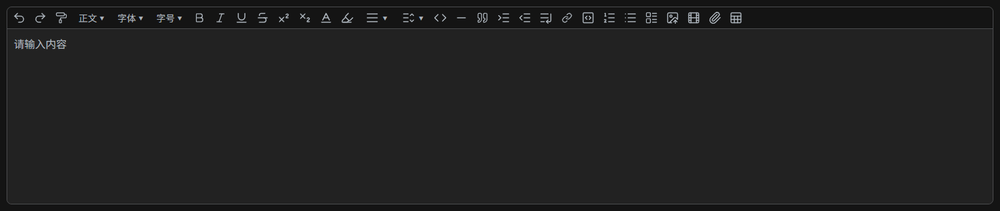

<h4 align="right"><strong>English</strong> | <a href="./README.zh-CN.md">简体中文</a> | <a href="./README.ja-JP.md">日本語</a></h4>
<br/>
<p align="center">
  
</p>
<h1 align="center">FreeEditor</h1>
<h4 align="center">A lightweight rich text editor built on the TipTap core</h4>
<h4 align="center">Out‑of‑the‑box, supports all front‑end frameworks, with built‑in Chinese, English, and Japanese languages, and is compatible with SSR</h4>
<p align="center">
  
</p>

---

## 🧭 Table of Contents

- [1. Quick Start](#quick-start)
- [2. Configuration Options](#configuration)
- [3. Instance Properties and Methods](#instance-properties-methods)
- [4. Built‑in Plugins](#built-in-plugins)
- [5. Media Upload](#media-upload)
- [6. Internationalization (i18n)](#i18n)
- [7. SSR Support](#ssr-support)

---

## 🚀 <a id="quick-start"></a>1. Quick Start

### Basic Usage

```typescript
import { Editor } from "@catmasks/free-editor";
import "@catmasks/free-editor/style.css";

// Create the editor
const editor = new Editor(document.getElementById("editor"), {
  content: "<p>Hello World</p>",
  placeholder: "Please enter content...",
});
```

### 💡 Tip

> If this project has been helpful to you, please consider giving it a ⭐. This way, you will receive timely notifications when new versions are released.

---

## 📦 Installation

```bash
npm install @catmasks/free-editor
```

or

```bash
pnpm add @catmasks/free-editor
```

### CDN Integration

If your project does not use build tools such as Vite or Webpack, you can leverage Free Editor via an ESM CDN.

> **⚠️ Important Notes**
>
> - For browser-based CDN scenarios, please use ESM exclusively.
> - **esm.sh** is recommended, as it automatically resolves Free Editor's npm dependencies without requiring manual dependency configuration.
> - Certain features of Free Editor employ dynamic `import()` loading, which generates a `chunks/` directory after the build. This directory must be deployed alongside `index.js`.
> - The `style.css` file must be imported separately.

#### Using esm.sh (Recommended)

```html
<!DOCTYPE html>
<html lang="zh-CN">
  <head>
    <meta charset="UTF-8" />
    <meta name="viewport" content="width=device-width, initial-scale=1.0" />

    <title>Free Editor CDN</title>

    <link
      rel="stylesheet"
      href="https://esm.sh/@catmasks/free-editor@1.0.0/style.css"
    />
  </head>

  <body>
    <div id="editor"></div>

    <script type="module">
      import { Editor } from "https://esm.sh/@catmasks/free-editor@1.0.0";

      const editor = new Editor(document.getElementById("editor"), {
        content: "<p>Hello World</p>",
        placeholder: "Please enter content...",
      });
    </script>
  </body>
</html>
```

> When using esm.sh, only `@catmasks/free-editor` needs to be imported; its npm dependencies are resolved automatically.

#### Using jsDelivr / unpkg

If you load Free Editor's `dist/index.js` directly, certain dependencies that have been externalised cannot be resolved natively by the browser as npm bare modules, for example:

```js
import { Editor } from "@tiptap/core";
```

In such cases, you must use an `importmap` to map the external dependencies:

```html
<script type="importmap">
  {
    "imports": {
      "@tiptap/core": "https://esm.sh/@tiptap/core@3.26.1",
      "@tiptap/pm/state": "https://esm.sh/@tiptap/pm@3.26.1/state",
      "@tiptap/pm/view": "https://esm.sh/@tiptap/pm@3.26.1/view",
      "@tiptap/pm/history": "https://esm.sh/@tiptap/pm@3.26.1/history",
      "@tiptap/extension-gapcursor": "https://esm.sh/@tiptap/extension-gapcursor@3.26.1",
      "docx": "https://esm.sh/docx@9.7.1",
      "jspdf": "https://esm.sh/jspdf@4.2.1",
      "markdown-it": "https://esm.sh/markdown-it@14.1.0",
      "prosemirror-markdown": "https://esm.sh/prosemirror-markdown@1.13.5"
    }
  }
</script>
```

> **Guidance**
>
> - It is strongly advisable to use esm.sh as the preferred approach.
> - If you opt for jsDelivr or unpkg, you must configure the `importmap` according to the external dependencies of the specific version you are using.
> - The built `chunks/` directory must be deployed together with `index.js`.
> - `style.css` must be imported as a separate resource.
> - For production projects, it is recommended to use npm/pnpm along with a build tool such as Vite.

---

## ⚙️ <a id="configuration"></a>2. Configuration Options

The constructor accepts an `EditorOptions` configuration object as its second argument:

```typescript
interface EditorOptions {
  content?: string;
  locale?: Locale;
  height?: number;
  maxHeight?: number;
  theme?: EditorTheme;
  disabled?: boolean;
  readonly?: boolean;
  placeholder?: string;
  include?: EditorPluginKey[];
  exclude?: EditorPluginKey[];
  uploader?: MediaUploaderOptions;
  onChange?: (html: string) => void;
  onCreated?: () => void;
}
```

### `content`

The initial content of the editor, provided as an HTML string.

```typescript
content?: string
```

### `locale`

The initial locale for the editor.

- **Default:** `"zh-CN"`
- **Allowed values:** `"zh-CN"` | `"en"` | `"ja-JP"`

```typescript
locale?: Locale
```

### `height`

The initial height of the editor, in pixels.

- **Default:** `undefined`

```typescript
height?: number
```

### `maxHeight`

The maximum height of the editor, in pixels.

- **Default:** `undefined`

```typescript
maxHeight?: number
```

### `theme`

The editor theme.

- **Default:** `"light"`
- **Allowed values:** `"light"` | `"dark"`

```typescript
theme?: EditorTheme
```

### `disabled`

Whether the editor is disabled.

- **Default:** `false`

```typescript
disabled?: boolean
```

### `readonly`

Whether the editor is read‑only.

- **Default:** `false`

```typescript
readonly?: boolean
```

### `placeholder`

The placeholder text displayed when the editor is empty.

- **Default:** `"Please enter content..."`

```typescript
placeholder?: string
```

### `include`

Only include the specified plugins. If empty, all plugins are included.

- **Default:** `[]` (all plugins)

```typescript
include?: EditorPluginKey[]
```

**Example:** Enable only headings and bold

```typescript
include: ["heading", "fontBold"];
```

### `exclude`

Exclude the specified plugins.

- **Default:** `[]` (exclude none)

```typescript
exclude?: EditorPluginKey[]
```

**Example:** Exclude code blocks

```typescript
exclude: ["codeBlock"];
```

### `uploader`

Media upload configuration, supporting independent settings for images, videos, and attachments. See [Chapter 5](#media-upload) for details.

```typescript
uploader?: MediaUploaderOptions
```

### `onChange`

Content change callback. Triggered whenever the document content changes (e.g., typing, executing commands, media upload). The callback receives the updated HTML string.

```typescript
onChange?: (html: string) => void
```

**Example:**

```typescript
const editor = new Editor(el, {
  onChange: (html) => {
    console.log("Content changed:", html);
  },
});
```

### `onCreated`

Created callback (no arguments). Triggered once the editor has been mounted and fully initialized.

```typescript
onCreated?: () => void
```

**Example:**

```typescript
const editor = new Editor(el, {
  onCreated: () => {
    console.log("Editor is mounted and initialized");
  },
});
```

---

## 🧩 <a id="instance-properties-methods"></a>3. Instance Properties and Methods

### 3.1 Instance Properties

#### `isMounted`

Returns whether the editor is mounted.

```typescript
console.log(editor.isMounted); // true
```

#### `isDestroyed`

Returns whether the editor is destroyed.

```typescript
console.log(editor.isDestroyed); // false
```

#### `theme`

Returns the current theme, either `"light"` or `"dark"`.

```typescript
console.log(editor.theme); // "light"
```

#### `isDark`

Returns whether dark mode is active.

```typescript
console.log(editor.isDark); // false
```

#### `disabled`

Returns whether the editor is disabled.

```typescript
console.log(editor.disabled); // false
```

#### `readonly`

Returns whether the editor is read‑only.

```typescript
console.log(editor.readonly); // false
```

#### `locale`

Returns the current locale.

```typescript
console.log(editor.locale); // "zh-CN"
```

### 3.2 Instance Methods

#### `setTheme(theme)`

Sets the theme.

```typescript
setTheme(theme: EditorTheme): void
```

| Parameter | Type          | Description                       |
| --------- | ------------- | --------------------------------- |
| `theme`   | `EditorTheme` | Theme name, `"light"` or `"dark"` |

#### `toggleTheme()`

Toggles between light and dark themes.

```typescript
toggleTheme(): void
```

#### `setLocale(locale)`

Sets the editor locale.

```typescript
setLocale(locale: Locale): void
```

| Parameter | Type     | Description                                    |
| --------- | -------- | ---------------------------------------------- |
| `locale`  | `Locale` | Target locale, `"zh-CN"`, `"en"`, or `"ja-JP"` |

#### `getHtml()`

Returns the editor content as HTML.

```typescript
getHtml(): string
```

#### `getJson()`

Returns the editor content as a JSON string.

```typescript
getJson(): string
```

**Returns:** `string` – JSON string  
**Throws:** If the editor has been destroyed, throws `Error: Editor has been destroyed`

#### `setHtml(html)`

Sets the editor HTML content. The editor content is replaced immediately; passing an empty string clears the content.

```typescript
setHtml(html: string): void
```

| Parameter | Type     | Description                    |
| --------- | -------- | ------------------------------ |
| `html`    | `string` | HTML string, may be empty      |

**Example:**

```typescript
// Replace content
editor.setHtml("<p>New content</p>");

// Clear content
editor.setHtml("");
```

**Throws:** If the editor has been destroyed, throws `Error: Editor has been destroyed`

#### `setDisabled(disabled)`

Sets the disabled state of the editor.

```typescript
setDisabled(disabled: boolean): void
```

#### `setReadonly(readonly)`

Sets the read‑only state of the editor.

```typescript
setReadonly(readonly: boolean): void
```

#### `destroy()`

Destroys the editor, cleaning up all resources and event listeners.

```typescript
destroy(): void
```

---

## 📋 <a id="built-in-plugins"></a>4. Built‑in Plugins

The following plugin keys (`EditorPluginKey`) are available:

| Plugin Key      | Name            | Description                                             |
| --------------- | --------------- | ------------------------------------------------------- |
| `heading`       | Heading         | Supports H1–H6 headings                                 |
| `fontBold`      | Bold            | Toggle bold formatting                                  |
| `fontItalic`    | Italic          | Toggle italic formatting                                |
| `fontColor`     | Font Color      | Set text color                                          |
| `fontHighlight` | Highlight       | Set background highlight                                |
| `fontFamily`    | Font Family     | Set font family                                         |
| `fontSize`      | Font Size       | Set font size                                           |
| `alignment`     | Alignment       | Left, center, or right alignment                        |
| `link`          | Link            | Insert, edit, or remove links                           |
| `codeBlock`     | Code Block      | Insert a code block                                     |
| `image`         | Image           | Insert images with drag‑and‑drop and paste support      |
| `video`         | Video           | Insert videos with drag‑and‑drop and paste support      |
| `attachment`    | Attachment      | Insert attachments with drag‑and‑drop and paste support |
| `underline`     | Underline       | Toggle underline                                        |
| `strike`        | Strikethrough   | Toggle strikethrough                                    |
| `superscript`   | Superscript     | Toggle superscript                                      |
| `subscript`     | Subscript       | Toggle subscript                                        |
| `orderedList`   | Ordered List    | Insert an ordered list                                  |
| `bulletList`    | Bullet List     | Insert an unordered list                                |
| `taskList`      | Task List       | Insert a task list with checkboxes                      |
| `indent`        | Increase Indent | Increase indentation                                    |
| `outdent`       | Decrease Indent | Decrease indentation                                    |
| `lineBreak`     | Line Break      | Insert a line break                                     |
| `lineHeight`    | Line Height     | Set paragraph line height                               |
| `blockquote`    | Blockquote      | Insert a blockquote                                     |
| `divider`       | Divider         | Insert a horizontal divider                             |
| `inlineCode`    | Inline Code     | Insert inline code (e.g., `code`)                       |
| `formatPainter` | Format Painter  | Format painter for copying text styles                  |
| `undo`          | Undo            | Undo the last action                                    |
| `redo`          | Redo            | Redo the last undone action                             |
| `table`         | Table           | Insert or edit a table                                  |
| `clearFormat`   | Clear Format    | Clear all text styles from the selected text            |
| `markdown`      | Markdown        | Support Markdown format                                 |
| `exportWord`    | Export as Word  | Export the content as a Word document                   |
| `importWord`    | Import Word     | Import a Word document into the editor                  |
| `exportPdf`     | Export as PDF   | Export the content as a PDF document                    |

> **💡 Tip:** Use the `include` or `exclude` options to flexibly control which plugins are enabled.

---

## 📎 <a id="media-upload"></a>5. Media Upload

### 5.1 Configuration Structure

Upload configuration is divided into three media types:

```typescript
interface MediaUploaderOptions {
  image?: MediaUploaderConfig; // Image upload configuration
  video?: MediaUploaderConfig; // Video upload configuration
  attachment?: MediaUploaderConfig; // Attachment upload configuration
}
```

### 5.2 Upload Configuration (`MediaUploaderConfig`)

The following options are available for each media type:

#### `action`

The upload endpoint URL.

```typescript
action?: string
```

#### `method`

The HTTP request method.

- **Default:** `"POST"`

```typescript
method?: string
```

#### `headers`

Request headers.

```typescript
headers?: HeadersInit
```

#### `withCredentials`

Whether to send credentials (cookies, etc.) with the request.

- **Default:** `false`

```typescript
withCredentials?: boolean
```

#### `fieldName`

The form field name for the file.

- **Default:** `"file"`

```typescript
fieldName?: string
```

#### `maxSize`

Maximum file size in bytes.

- **Default:** `Infinity`

```typescript
maxSize?: number
```

#### `accept`

An array of allowed MIME types.

```typescript
accept?: string[]
```

**Example:**

```typescript
accept: ["image/png", "image/jpeg"];
```

#### `data`

Additional form data, either as an object or a function returning an object.

```typescript
data?: Record<string, any> | (() => Record<string, any>)
```

#### `format`

A function to format the server response, returning a standard `UploadResult`.

```typescript
format?: (result: any) => UploadResult | Promise<UploadResult>
```

**Example:**

```typescript
format: (response) => ({
  url: response.data.url,
  name: response.data.filename,
});
```

#### `upload`

A custom upload function. If provided, it replaces the default upload logic.

```typescript
upload?: (file: File, context: UploadContext) => Promise<UploadResult>
```

**Parameters:**

- `file` – The file to upload.
- `context` – Upload context, containing `signal` (abort signal), `config` (configuration), and `onProgress` (progress callback).

**Example:**

```typescript
upload: async (file, context) => {
  const formData = new FormData();
  formData.append("file", file);

  const res = await fetch("/api/upload", {
    method: "POST",
    body: formData,
    signal: context.signal,
  });

  const data = await res.json();

  context.onProgress?.({ percent: 100 });

  return {
    url: data.url,
    name: data.name,
  };
};
```

#### `beforeUpload`

A hook called before upload. Return `false` to cancel, or return a new `File` to replace the original.

```typescript
beforeUpload?: (file: File) => File | false | Promise<File | false>
```

#### `validate`

Validate the file. Return an error message string to indicate failure.

```typescript
validate?: (file: File) => string | void
```

**Example:**

```typescript
validate: (file) => {
  if (file.size > 10 * 1024 * 1024) {
    return "File size must not exceed 10 MB";
  }
};
```

### 5.3 Callback Events

#### `onProgress`

Progress callback during upload.

```typescript
onProgress?: (progress: UploadProgress, file: File) => void
```

`UploadProgress` structure:

```typescript
interface UploadProgress {
  loaded: number; // Bytes uploaded so far
  total: number; // Total bytes
  percent: number; // Percentage complete
}
```

#### `onSuccess`

Success callback.

```typescript
onSuccess?: (result: UploadResult, file: File) => void
```

`UploadResult` structure:

```typescript
interface UploadResult {
  url: string; // Resource URL
  name?: string; // File name
}
```

#### `onUploadError`

Error callback for upload failures.

```typescript
onUploadError?: (error: Error, file: File) => void
```

#### `onTypeError`

Callback for file type errors.

```typescript
onTypeError?: (error: Error, file: File) => void
```

#### `onSizeError`

Callback for file size errors.

```typescript
onSizeError?: (error: Error, file: File) => void
```

#### `onValidateError`

Callback for validation errors.

```typescript
onValidateError?: (error: Error, file: File) => void
```

### 5.4 Complete Example

```typescript
import { Editor, i18n } from "@catmasks/free-editor";
import type { UploadResult, UploadContext } from "@catmasks/free-editor";

const editor = new Editor(document.getElementById("editor"), {
  uploader: {
    // Image upload configuration
    image: {
      maxSize: 5 * 1024 * 1024, // 5 MB
      accept: ["image/png", "image/jpeg"],
      async upload(file: File, ctx: UploadContext) {
        return new Promise<UploadResult>((resolve, reject) => {
          // Custom upload logic...
          resolve({ url: "https://example.com/image.png" });
        });
      },
    },
    // Video upload configuration
    video: {
      maxSize: 500 * 1024 * 1024, // 500 MB
      accept: ["video/*"],
      onUploadError(error) {
        alert(i18n.t("upload.uploadFailed"));
      },
    },
    // Attachment upload configuration
    attachment: {
      onSuccess(result, file) {
        console.log("Upload successful:", result.url);
      },
    },
  },
});
```

---

## 🌐 <a id="i18n"></a>6. Internationalization (i18n)

`i18n` is the global internationalisation singleton provided by Free Editor. It manages the editor's language, translation messages, and custom language extensions.

```typescript
import { i18n } from "@catmasks/free-editor";
```

Free Editor includes the following built‑in languages:

- `zh-CN`: Simplified Chinese
- `en`: English
- `ja-JP`: Japanese

Custom languages can be registered via `addMessages()`.

---

### 6.1 Properties

#### `locale`

Returns the currently active language.

```typescript
console.log(i18n.locale);
// "zh-CN"
```

Type:

```typescript
Locale;
```

---

### 6.2 Methods

#### `t(key, ...args)`

Retrieves the translation for the specified `key` in the current language.

Supports dot‑notation for nested keys and placeholder replacement with `{0}`, `{1}`, etc.

```typescript
t(key: string, ...args: unknown[]): string
```

**Examples:**

```typescript
i18n.t("toolbar.bold");
// "Bold"

i18n.t("upload.fileSizeExceeded");
// "File size exceeds the limit"
```

With placeholders:

```typescript
i18n.t("common.count", 10);
// e.g., "Total 10 items"
```

If the key does not exist, the key itself is returned:

```typescript
i18n.t("unknown.key");
// "unknown.key"
```

**Main translation namespaces:**

| Namespace    | Description         |
| ------------ | ------------------- |
| `common`     | Common text         |
| `toolbar`    | Toolbar labels      |
| `link`       | Link‑related text   |
| `fontFamily` | Font family labels  |
| `fontSize`   | Font size labels    |
| `alignment`  | Alignment labels    |
| `lineHeight` | Line height labels  |
| `heading`    | Heading labels      |
| `upload`     | Upload‑related text |
| `media`      | Media node labels   |
| `attachment` | Attachment labels   |
| `table`      | Table‑related text  |

---

#### `setLocale(locale)`

Switches the current language.

```typescript
setLocale(locale: Locale): void
```

**Parameters:**

| Parameter | Type     | Description             |
| --------- | -------- | ----------------------- |
| `locale`  | `Locale` | A registered locale key |

Built‑in locales:

```typescript
i18n.setLocale("zh-CN");
i18n.setLocale("en");
i18n.setLocale("ja-JP");
```

If the specified locale has not been registered, the call has no effect.

```typescript
i18n.setLocale("ko-KR");
// No change if "ko-KR" has not been registered via addMessages()
```

After switching, all subscribers registered via `subscribe()` will be notified.

---

#### `getLocales()`

Returns an array of all registered locales.

```typescript
getLocales(): Locale[]
```

**Example:**

```typescript
const locales = i18n.getLocales();

console.log(locales);
// ["zh-CN", "en", "ja-JP"]
```

After registering a custom language:

```typescript
i18n.addMessages("ko-KR", koKR);

console.log(i18n.getLocales());
// ["zh-CN", "en", "ja-JP", "ko-KR"]
```

The returned array is a new copy; it does not directly mutate the internal registry.

---

#### `hasLocale(locale)`

Checks whether a given locale has been registered.

```typescript
hasLocale(locale: Locale): boolean
```

**Example:**

```typescript
i18n.hasLocale("zh-CN");
// true

i18n.hasLocale("ko-KR");
// false
```

After registering a custom language:

```typescript
i18n.addMessages("ko-KR", koKR);

i18n.hasLocale("ko-KR");
// true
```

This method is useful for checking before calling `setLocale()` or `addMessages()`.

---

#### `getMessages(locale)`

Returns the original message object for the specified locale.

```typescript
getMessages(locale: Locale): LocaleMessages | undefined
```

**Example:**

```typescript
const messages = i18n.getMessages("zh-CN");

console.log(messages?.toolbar.bold);
// "Bold" (in Chinese)
```

If the locale does not exist, returns `undefined`:

```typescript
const messages = i18n.getMessages("ko-KR");

console.log(messages);
// undefined
```

> **Note:**
> `getMessages()` returns the **original** locale messages as registered, without any extensions applied via `extend()`.

---

#### `getCurrentMessages()`

Returns the final message object used by the current locale.

```typescript
getCurrentMessages(): LocaleMessages
```

Unlike `getMessages()`, this method returns the actual `_messages` in use, so it includes any extensions added via `extend()`.

**Example:**

```typescript
i18n.extend({
  toolbar: {
    bold: "Custom Bold",
  },
});

const messages = i18n.getCurrentMessages();

console.log(messages.toolbar.bold);
// "Custom Bold"
```

Conceptually:

```text
getMessages()
    ↓
Returns the original locale messages

getCurrentMessages()
    ↓
Returns the final messages currently in use
    ↓
Includes extensions from extend()
```

---

#### `addMessages(locale, messages)`

Registers a new language.

```typescript
addMessages(
  locale: Locale,
  messages: LocaleMessages,
): void
```

This method **can only register languages that do not already exist**; it cannot override an existing one.

Therefore, built‑in languages cannot be overridden:

```typescript
i18n.addMessages("zh-CN", messages);
// ❌ Not allowed

i18n.addMessages("en", messages);
// ❌ Not allowed

i18n.addMessages("ja-JP", messages);
// ❌ Not allowed
```

Custom languages can be registered normally:

```typescript
import koKR from "./locales/ko-KR";

i18n.addMessages("ko-KR", koKR);
```

Once registered, you can switch to it:

```typescript
i18n.setLocale("ko-KR");

console.log(i18n.locale);
// "ko-KR"
```

You can also register other languages:

```typescript
i18n.addMessages("fr-FR", frFR);
i18n.addMessages("de-DE", deDE);
```

> **Note:**
> `addMessages()` does not override an existing locale, including custom ones registered earlier. Attempting to re‑register an existing locale will throw an error.

---

#### `extend(messages)`

Extends the message object of the current locale.

```typescript
extend(
  messages: DeepPartial<LocaleMessages>,
): void
```

This method performs a **deep merge**, so you only need to provide the fields you wish to add or override.

**Example:**

```typescript
import { i18n } from "@catmasks/free-editor";

i18n.extend({
  toolbar: {
    bold: "Custom Bold",
    italic: "Custom Italic",
  },
});
```

Other fields in the original locale messages remain unchanged.

For instance:

```typescript
i18n.extend({
  toolbar: {
    bold: "Bold",
  },
});
```

Only `toolbar.bold` is modified; `toolbar.italic`, `toolbar.underline`, `toolbar.strike` are unaffected.

> **Note:**
> `extend()` modifies the final message object currently in use. It does **not** modify the original messages returned by `getMessages()`. When `setLocale()` is called, the message object is rebuilt from the target locale's original messages, so any `extend()` modifications made for the previous locale will not automatically carry over.

---

#### `subscribe(callback)`

Subscribes to language change events.

```typescript
subscribe(
  callback: (locale: Locale) => void,
): () => void
```

Whenever `setLocale()` is called, all subscribers will be invoked with the new locale.

**Example:**

```typescript
const unsubscribe = i18n.subscribe((locale) => {
  console.log("Language changed to:", locale);
});

i18n.setLocale("en");
// "Language changed to: en"
```

`subscribe()` returns an unsubscribe function:

```typescript
unsubscribe();
```

After unsubscribing, the callback will no longer receive notifications.

> **Note:**
> If a component or module no longer needs to listen for language changes, be sure to call the unsubscribe function to avoid unnecessary callbacks and potential memory leaks.

---

### 6.3 Custom Languages

Free Editor supports registering custom languages via `addMessages()`.

For example, to add Korean:

```typescript
import { i18n } from "@catmasks/free-editor";
import koKR from "./locales/ko-KR";

i18n.addMessages("ko-KR", koKR);

i18n.setLocale("ko-KR");

console.log(i18n.locale);
// "ko-KR"
```

After registration, you can use it normally:

```typescript
i18n.t("toolbar.bold");
```

You can also retrieve all registered locales with:

```typescript
i18n.getLocales();
// ["zh-CN", "en", "ja-JP", "ko-KR"]
```

---

### 6.4 API Summary

| API                    | Type                          | Description                                      |
| ---------------------- | ----------------------------- | ------------------------------------------------ |
| `locale`               | `Locale`                      | Current locale                                   |
| `t()`                  | `string`                      | Translate a key                                  |
| `setLocale()`          | `void`                        | Switch the current locale                        |
| `getLocales()`         | `Locale[]`                    | Get all registered locales                       |
| `hasLocale()`          | `boolean`                     | Check if a locale is registered                  |
| `getMessages()`        | `LocaleMessages \| undefined` | Get the original messages for a locale           |
| `getCurrentMessages()` | `LocaleMessages`              | Get the final messages currently in use          |
| `addMessages()`        | `void`                        | Register a new locale (cannot override existing) |
| `extend()`             | `void`                        | Extend the current locale messages               |
| `subscribe()`          | `() => void`                  | Subscribe to language changes                    |

### 6.5 Built‑in and Custom Locales

Free Editor defines:

```typescript
type BuiltinLocale = "zh-CN" | "en" | "ja-JP";
```

`Locale` extends this to allow custom locales:

```typescript
type Locale = BuiltinLocale | (string & {});
```

Thus, you can use built‑in locales:

```typescript
i18n.setLocale("zh-CN");
i18n.setLocale("en");
i18n.setLocale("ja-JP");
```

And also register and use custom ones:

```typescript
i18n.addMessages("ko-KR", koKR);
i18n.setLocale("ko-KR");
```

---

## 🖥️ <a id="ssr-support"></a>7. SSR Support

FreeEditor can be safely loaded in server-side rendering (SSR) environments, including Vue SSR, Nuxt, Vite SSR, and Node.js. Importing the npm package on the server does not touch any browser‑only APIs (such as `window`, `document`, or `navigator`); browser‑specific logic is deferred until the relevant feature is actually executed, so loading the main entry on the server does not cause errors.

### 7.1 Usage Principles

When using the editor in an SSR environment, follow these principles:

- **On the server (SSR phase)**: only `import` the package safely (for example, to read types or `i18n`); do **not** create an editor instance.
- **In the browser (client)**: create the editor with `new Editor()` after the component is mounted (such as in Vue's `onMounted` or React's `useEffect`).
- If `new Editor()` is mistakenly called on the server, an explicit environment error is thrown to help you locate the issue.
- Heavy dependencies required for export and import (such as `docx`, `mammoth`, `html2canvas`, and `jspdf`) are loaded on demand through dynamic `import()`, and are only loaded when the corresponding feature is invoked.

### 7.2 Vue 3 Example

In Vue 3, it is recommended to create the editor in `onMounted` and destroy it when the component unmounts:

```vue
<script setup lang="ts">
import { onBeforeUnmount, onMounted, ref } from "vue";
import { Editor } from "@catmasks/free-editor";

let editor: Editor | null = null;
const editorEl = ref<HTMLElement | null>(null);

onMounted(() => {
  // Only create the editor instance in the browser
  if (editorEl.value) {
    editor = new Editor(editorEl.value, {
      content: "<p>Hello World</p>",
    });
  }
});

onBeforeUnmount(() => {
  editor?.destroy();
  editor = null;
});
</script>

<template>
  <div ref="editorEl"></div>
</template>
```

### 7.3 Nuxt Tips

When using Nuxt, it is recommended to wrap the editor with the built‑in `<ClientOnly>` component, or to check `import.meta.client` in `<script setup>`, so that the editor is rendered and mounted only on the client.

### 7.4 Server‑Side Loading Verification

The following example runs in a Node.js environment and verifies that the npm package can be safely loaded on the SSR server:

```typescript
import { Editor, i18n } from "@catmasks/free-editor";

// Reading locale and other info on the server is allowed (no browser dependency)
console.log(i18n.locale);

// Do not call new Editor() here unless a DOM is present
```

### 7.5 Notes

- `style.css` needs to be imported separately on the client.
- The dynamic `chunks/` directory in the build output must be deployed together with `index.js`.
- When importing in an SSR environment, ensure that the editor instance is created only in the browser.

---
