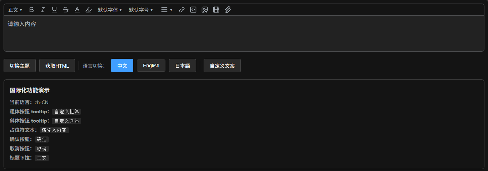

<h4 align="right"><strong>English</strong> | <a href="./README.zh-CN.md">简体中文</a> | <a href="./README.ja-JP.md">日本語</a></h4>
<br/>
<p align="center">
  
</p>
<h1 align="center">FreeEditor</h1>
<h4 align="center">A lightweight rich text editor built on the TipTap core</h4>
<h4 align="center">Out-of-the-box, supports all frontend frameworks, built-in Chinese, English, and Japanese</h4>
<p align="center">
  
</p>

### Get Started

If this helps you, please give us a star so you can be notified when new versions are released.

```bash
npm install @catmasks/free-editor
```

or

```bash
pnpm add @catmasks/free-editor
```

### CDN Usage

If your project doesn't use a bundler, you can use the editor directly in the browser via an ESM CDN.

> **Note**:
>
> - This package only provides ESM format. It must be loaded with `<script type="module">`. Traditional `<script>` tag imports are not supported.
> - Since `@tiptap/core`, `@tiptap/pm`, and `@tiptap/extension-gapcursor` are externalized as peerDependencies, make sure these dependencies can be resolved when using CDN. Using a CDN like esm.sh that supports automatic dependency resolution saves manual configuration.

**Using esm.sh (Recommended)**

esm.sh automatically resolves and loads peerDependencies, no manual import needed.

```html
<script type="module">
  import { Editor, i18n } from "https://esm.sh/@catmasks/free-editor@0.0.4";
  import "https://esm.sh/@catmasks/free-editor@0.0.4/style.css";

  const editor = new Editor(document.getElementById("editor"), {
    content: "<p>Hello World</p>",
    placeholder: "Please enter content...",
  });
</script>
```

**Using importmap (Optional)**

If you prefer bare import style, you can use importmap:

```html
<script type="importmap">
  {
    "imports": {
      "@catmasks/free-editor": "https://esm.sh/@catmasks/free-editor@0.0.4",
      "@catmasks/free-editor/style.css": "https://esm.sh/@catmasks/free-editor@0.0.4/style.css"
    }
  }
</script>

<script type="module">
  import { Editor, i18n } from "@catmasks/free-editor";
  import "@catmasks/free-editor/style.css";

  const editor = new Editor(document.getElementById("editor"), {
    content: "<p>Hello World</p>",
  });
</script>
```

**Using jsdelivr / unpkg (Alternative)**

When using jsdelivr or unpkg, make sure peerDependencies are also loaded correctly (esm.sh with auto-resolution is recommended).

```html
<script type="importmap">
  {
    "imports": {
      "@tiptap/core": "https://esm.sh/@tiptap/core@3.26.1",
      "@tiptap/pm": "https://esm.sh/@tiptap/pm@3.26.1",
      "@tiptap/pm/state": "https://esm.sh/@tiptap/pm@3.26.1/state",
      "@tiptap/pm/view": "https://esm.sh/@tiptap/pm@3.26.1/view",
      "@tiptap/extension-gapcursor": "https://esm.sh/@tiptap/extension-gapcursor@3.26.1"
    }
  }
</script>
<script type="module">
  import {
    Editor,
    i18n,
  } from "https://cdn.jsdelivr.net/npm/@catmasks/free-editor@0.0.4/dist/index.js";
  import "https://cdn.jsdelivr.net/npm/@catmasks/free-editor@0.0.4/dist/style.css";
</script>
```

> **Tips**:
>
> - Replace `@0.0.4` with the actual version you are using.
> - The `style.css` stylesheet **must be imported separately**, otherwise the editor will not display correctly.

## Navigation

- [1. Quick Start](#1-quick-start)
- [2. Configuration](#2-configuration)
- [3. Instance Properties & Methods](#3-instance-properties--methods)
- [4. Built-in Plugins](#4-built-in-plugins)
- [5. Media Upload](#5-media-upload)
- [6. Internationalization (i18n)](#6-internationalization-i18n)

---

## 1. Quick Start

### Basic Usage

```typescript
import { Editor } from "@catmasks/free-editor";
import "@catmasks/free-editor/style.css";

// Create editor
const editor = new Editor(document.getElementById("editor"), {
  content: "<p>Hello World</p>",
  placeholder: "Please enter content...",
});
```

---

## 2. Configuration

The second parameter of the constructor accepts an `EditorOptions` object:

```typescript
interface EditorOptions {
  content?: string;
  locale?: Locale;
  theme?: EditorTheme;
  placeholder?: string;
  include?: EditorPluginKey[];
  exclude?: EditorPluginKey[];
  uploader?: MediaUploaderOptions;
}
```

### `content`

Initial editor content as an HTML string.

```typescript
content?: string
```

### `locale`

Initial editor locale.

- **Default:** `"zh-CN"`
- **Allowed values:** `"zh-CN"` | `"en"` | `"ja-JP"`

```typescript
locale?: Locale
```

### `theme`

Editor theme.

- **Default:** `"light"`
- **Allowed values:** `"light"` | `"dark"`

```typescript
theme?: EditorTheme
```

### `placeholder`

Placeholder text shown when the editor is empty.

- **Default:** `"Please enter content..."`

```typescript
placeholder?: string
```

### `include`

Only include the specified plugins. If empty, all plugins are included.

- **Default:** `[]` (all plugins)

```typescript
include?: EditorPluginKey[]
```

**Example:** Enable only heading and bold

```typescript
include: ["heading", "fontBold"];
```

### `exclude`

Exclude the specified plugins.

- **Default:** `[]` (none excluded)

```typescript
exclude?: EditorPluginKey[]
```

**Example:** Exclude code block

```typescript
exclude: ["codeBlock"];
```

### `uploader`

Media upload configuration, with independent settings for images, videos, and attachments. See [Chapter 5](#5-media-upload) for details.

```typescript
uploader?: MediaUploaderOptions
```

---

## 3. Instance Properties & Methods

### 3.1 Instance Properties

#### `isMounted`

Returns whether the editor is mounted.

```typescript
console.log(editor.isMounted); // true
```

#### `isDestroyed`

Returns whether the editor has been destroyed.

```typescript
console.log(editor.isDestroyed); // false
```

#### `theme`

Returns the current theme (`"light"` or `"dark"`).

```typescript
console.log(editor.theme); // "light"
```

#### `isDark`

Returns `true` if dark mode is active.

```typescript
console.log(editor.isDark); // false
```

#### `locale`

Returns the current locale.

```typescript
console.log(editor.locale); // "zh-CN"
```

### 3.2 Instance Methods

#### `setTheme(theme)`

Sets the theme.

```typescript
setTheme(theme: EditorTheme): void
```

**Parameters:**

| Parameter | Type          | Description                       |
| --------- | ------------- | --------------------------------- |
| `theme`   | `EditorTheme` | Theme name: `"light"` or `"dark"` |

#### `toggleTheme()`

Toggles between light and dark themes.

```typescript
toggleTheme(): void
```

#### `setLocale(locale)`

Sets the editor locale.

```typescript
setLocale(locale: Locale): void
```

**Parameters:**

| Parameter | Type     | Description                                    |
| --------- | -------- | ---------------------------------------------- |
| `locale`  | `Locale` | Target locale: `"zh-CN"`, `"en"`, or `"ja-JP"` |

#### `getHtml()`

Returns the editor's HTML content.

```typescript
getHtml(): string
```

**Returns:** `string` – HTML string

**Throws:** `Error: Editor has been destroyed` if the editor is destroyed.

#### `destroy()`

Destroys the editor, cleaning up all resources and event listeners.

```typescript
destroy(): void
```

---

## 4. Built-in Plugins

Here are all available plugin keys (`EditorPluginKey`):

| Plugin Key      | Name          | Description                                       |
| --------------- | ------------- | ------------------------------------------------- |
| `heading`       | Heading       | Supports H1–H6 headings                           |
| `fontBold`      | Bold          | Toggle bold                                       |
| `fontItalic`    | Italic        | Toggle italic                                     |
| `fontColor`     | Font Color    | Set text color                                    |
| `fontHighlight` | Highlight     | Set text background highlight                     |
| `fontFamily`    | Font Family   | Set font family                                   |
| `fontSize`      | Font Size     | Set font size                                     |
| `alignment`     | Alignment     | Text left/center/right alignment                  |
| `link`          | Link          | Insert/edit/remove link                           |
| `codeBlock`     | Code Block    | Insert code block                                 |
| `image`         | Image         | Insert image, supports drag-and-drop / paste      |
| `video`         | Video         | Insert video, supports drag-and-drop / paste      |
| `attachment`    | Attachment    | Insert attachment, supports drag-and-drop / paste |
| `underline`     | Underline     | Add underline to text                             |
| `strike`        | Strikethrough | Add strikethrough to text                         |
| `superscript`   | Superscript   | Add superscript to text                           |
| `subscript`     | Subscript     | Add subscript to text                             |
| `orderedList`   | OrderedList   | Insert ordered list                               |
| `bulletList`    | BulletList    | Insert bullet list                                |

> **Tip:** Use `include` or `exclude` options to flexibly control which plugins are enabled.

---

## 5. Media Upload

### 5.1 Configuration Structure

Upload configuration is grouped by media type:

```typescript
interface MediaUploaderOptions {
  image?: MediaUploaderConfig; // Image upload config
  video?: MediaUploaderConfig; // Video upload config
  attachment?: MediaUploaderConfig; // Attachment upload config
}
```

### 5.2 Upload Configuration (`MediaUploaderConfig`)

Below are all configurable options for a single media type:

#### `action`

Upload endpoint URL.

```typescript
action?: string
```

#### `method`

HTTP method.

- **Default:** `"POST"`

```typescript
method?: string
```

#### `headers`

Request headers.

```typescript
headers?: HeadersInit
```

#### `withCredentials`

Whether to send credentials (cookies, etc.).

- **Default:** `false`

```typescript
withCredentials?: boolean
```

#### `fieldName`

Form field name.

- **Default:** `"file"`

```typescript
fieldName?: string
```

#### `maxSize`

Maximum file size in bytes.

- **Default:** `Infinity`

```typescript
maxSize?: number
```

#### `accept`

Array of accepted file MIME types.

```typescript
accept?: string[]
```

**Example:**

```typescript
accept: ["image/png", "image/jpeg"];
```

#### `data`

Additional form data, supports an object or a function returning an object.

```typescript
data?: Record<string, any> | (() => Record<string, any>)
```

#### `format`

Format the server response result, returning a standard `UploadResult`.

```typescript
format?: (result: any) => UploadResult | Promise<UploadResult>
```

**Example:**

```typescript
format: (response) => ({
  url: response.data.url,
  name: response.data.filename,
});
```

#### `upload`

Custom upload function. When set, the default upload logic is replaced.

```typescript
upload?: (file: File, context: UploadContext) => Promise<UploadResult>
```

**Parameters:**

- `file` – The file object
- `context` – Upload context, containing `signal` (abort signal), `config` (configuration), `onProgress` (progress callback)

**Example:**

```typescript
upload: async (file, context) => {
  const formData = new FormData();
  formData.append("file", file);

  const res = await fetch("/api/upload", {
    method: "POST",
    body: formData,
    signal: context.signal,
  });

  const data = await res.json();

  context.onProgress?.({ percent: 100 });

  return {
    url: data.url,
    name: data.name,
  };
};
```

#### `beforeUpload`

Pre-upload hook. Return `false` to cancel upload, or return a new `File` to replace the original.

```typescript
beforeUpload?: (file: File) => File | false | Promise<File | false>
```

#### `validate`

Validate the file. Return an error message string to indicate failure.

```typescript
validate?: (file: File) => string | void
```

**Example:**

```typescript
validate: (file) => {
  if (file.size > 10 * 1024 * 1024) {
    return "File cannot exceed 10MB";
  }
};
```

### 5.3 Callback Events

#### `onProgress`

Upload progress callback.

```typescript
onProgress?: (progress: UploadProgress, file: File) => void
```

`UploadProgress` structure:

```typescript
interface UploadProgress {
  loaded: number; // Loaded bytes
  total: number; // Total bytes
  percent: number; // Percentage
}
```

#### `onSuccess`

Upload success callback.

```typescript
onSuccess?: (result: UploadResult, file: File) => void
```

`UploadResult` structure:

```typescript
interface UploadResult {
  url: string; // Resource URL
  name?: string; // File name
}
```

#### `onUploadError`

Upload error callback.

```typescript
onUploadError?: (error: Error, file: File) => void
```

#### `onTypeError`

File type error callback.

```typescript
onTypeError?: (error: Error, file: File) => void
```

#### `onSizeError`

File size error callback.

```typescript
onSizeError?: (error: Error, file: File) => void
```

#### `onValidateError`

Validation error callback.

```typescript
onValidateError?: (error: Error, file: File) => void
```

### 5.4 Complete Example

```typescript
import { Editor, i18n } from "@catmasks/free-editor";
import type { UploadResult, UploadContext } from "@catmasks/free-editor";

const editor = new Editor(document.getElementById("editor"), {
  uploader: {
    // Image upload config
    image: {
      maxSize: 5 * 1024 * 1024, // 5MB
      accept: ["image/png", "image/jpeg"],
      async upload(file: File, ctx: UploadContext) {
        return new Promise<UploadResult>((resolve, reject) => {
          // Custom upload logic...
          resolve({ url: "https://example.com/image.png" });
        });
      },
    },
    // Video upload config
    video: {
      maxSize: 500 * 1024 * 1024, // 500MB
      accept: ["video/*"],
      onUploadError(error) {
        alert(i18n.t("upload.uploadFailed"));
      },
    },
    // Attachment upload config
    attachment: {
      onSuccess(result, file) {
        console.log("Upload success:", result.url);
      },
    },
  },
});
```

---

## 6. Internationalization (i18n)

`i18n` is a global singleton for managing multilingual support.

```typescript
import { i18n } from "@catmasks/free-editor";
```

### 6.1 Properties

#### `locale`

Current locale.

```typescript
console.log(i18n.locale); // "zh-CN"
```

### 6.2 Methods

#### `t(key, ...args)`

Returns the translated text for `key` in the current locale. Supports placeholder replacement `{0}`, `{1}`...

```typescript
t(key: string, ...args: any[]): string
```

**Example:**

```typescript
i18n.t("toolbar.bold"); // "Bold"
i18n.t("upload.fileSizeExceeded"); // "File size exceeded"
```

**Available translation keys:**

| Namespace    | Description             |
| ------------ | ----------------------- |
| `common`     | Common text             |
| `toolbar`    | Toolbar text            |
| `link`       | Link-related text       |
| `fontFamily` | Font-related text       |
| `fontSize`   | Font size-related text  |
| `alignment`  | Alignment-related text  |
| `heading`    | Heading-related text    |
| `upload`     | Upload-related text     |
| `media`      | Media node text         |
| `attachment` | Attachment-related text |

#### `setLocale(locale)`

Sets the current locale.

```typescript
setLocale(locale: Locale): void
```

**Parameters:**

| Parameter | Type     | Description                                    |
| --------- | -------- | ---------------------------------------------- |
| `locale`  | `Locale` | Target locale: `"zh-CN"`, `"en"`, or `"ja-JP"` |

#### `extend(messages)`

Extends the current locale's message object (deep merge).

> **Note:** This method must be called **before** the editor is initialized; otherwise it has no effect on the editor.

```typescript
extend(messages: DeepPartial<LocaleMessages>): void
```

**Example:**

```typescript
import { i18n } from "@catmasks/free-editor";

// Extend translations before creating the editor
i18n.extend({
  toolbar: {
    bold: "Custom Bold",
    italic: "Custom Italic",
  },
});

// Then create the editor
const editor = new Editor(...);
```

#### `subscribe(callback)`

Subscribes to locale change events. Returns an unsubscribe function.

> **Note:** Call the returned unsubscribe function when destroying to prevent memory leaks.

```typescript
subscribe(callback: (locale: Locale) => void): () => void
```

**Example:**

```typescript
const unsubscribe = i18n.subscribe((locale) => {
  console.log("Locale changed to:", locale);
});

// Unsubscribe when no longer needed
unsubscribe();
```
